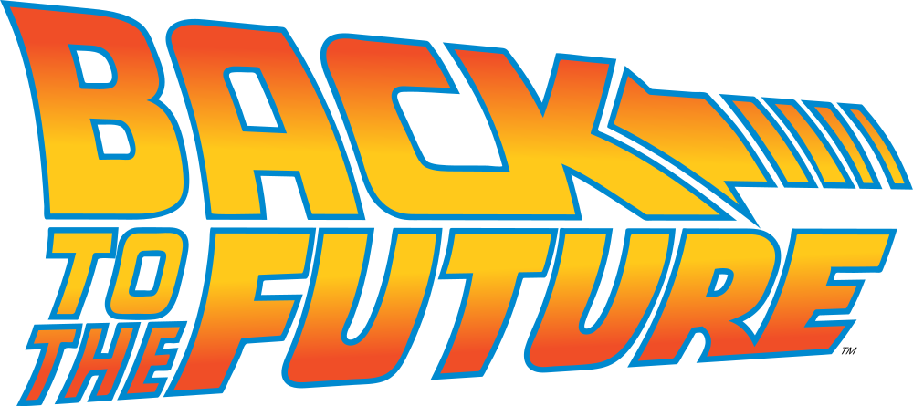

# Back to the Future

> „Programming described the three programmer's virtues: hubris, laziness, and impatience.“ *Larry Wall*

 project. Fasten your seatbelts. Let's start traveling through time!

See:
* https://github.com/lhsradek/bttf/blob/main/png/bttf06.png

The technology used:

* Kotlin therefore Java
* Spring Boot (controllers, services, listeners, thymeleaf, flyway, quartz scheduler)
* JPA (hibernate with envers audit)
* DB: PostgreSQL, MariaDB, H2 [See](https://github.com/lhsradek/bttf/tree/main/bttf-impl/src/main/resources/db/specific)
* OpenAPI [See](https://github.com/lhsradek/bttf/blob/main/png/bttf03.png)
* AES encrypted data
* Redis (Sessions, Message broker)
* Tomcat (Webs servlet/JSP container) [See](https://github.com/lhsradek/bttf/blob/main/png/bttf05.png)
* Nginx - load balancer for Tomcat (port 8443 -> 443) and PhP FastCGI for SQL Adminer
* Traefik - load balancer for Docker
* Elasticsearch (Filebeat, Metricbeat, APM)
* Docker and DockerHub
* Linux (Alpine, Debian, Ubuntu)
* Midjourney

Thank you all for these technologies. Thanks to Microsoft for finally making friends with Linux and for GitHub. Thanks to Google for translater and advice leader on StackOverflow.

Development Plan: This recession game is supposed to be multiplayer and the manager will see who is playingin log. Whoever plays long enough will get the manager's password. Whoever lasts even longer gets and travels many years in time, gets an admin password and can try OpenAPI. You've probably already understood that I'm more focused on the backend, so wait for javascript or react or something from https://kotlinlang.org/docs/js-overview.html until later.

